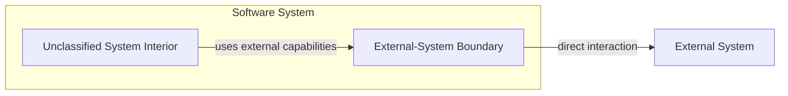

# Architecture Model

Architecture Atlas describes the logical architecture of a `Software System` as a progressively refined map of semantic responsibilities and relationships

The model is intentionally incomplete by default. New architectural distinctions are added only after real codebase experience shows that a responsibility pattern is stable, reusable and materially useful for design or review

## Core terms

### Software System

The semantic subject whose codebase architecture is being analyzed

A Software System may be implemented by one repository, many repositories, one package, a monorepo, a CLI, a library, a backend service or another physical arrangement. Repository boundaries do not define the Software System automatically

### Architectural Entity

A material semantic unit that owns or carries a coherent architectural responsibility

An Architectural Entity is not defined by a file, package, directory, module or repository. A physical code container may implement one entity, several entities or only part of one entity

### Architectural Role

A reusable named responsibility pattern that can be assigned to an Architectural Entity when the entity materially satisfies that role's meaning

A role defines architecture-wise responsibilities, allowed relationships and lint conditions. It does not prescribe a physical implementation shape

Roles are added to the Atlas only when repeated experience shows that the distinction has stable architecture value

### Relationship

A material semantic relationship between Architectural Entities or between an entity and an External System

Relationships may describe dependency, direct interaction, information flow, coordination, authority or another architectural relation. Physical import edges may provide evidence of a relationship but do not define its full meaning

### External System

A system, facility, process, provider or runtime outside the target Software System whose semantics and lifecycle are not owned by the target Software System

Examples include third-party HTTP APIs, operating-system facilities, command-line tools, databases, cloud services and provider SDK-backed systems

### Unclassified System Interior

The material interior of a Software System that has not yet been assigned a known Architectural Role by the current Atlas

`Unclassified System Interior` is not a role, layer or defect. It preserves uncertainty and prevents the current model from forcing responsibilities into premature categories

As new reusable roles are identified, appropriate entities may be carved out of the previously unclassified interior

## Current panorama

The diagram expresses the currently known architecture vocabulary, not a mandatory runtime call graph or physical layering scheme

## Current known role

### External-System Boundary

An `External-System Boundary` is the lowest semantic boundary owned by the Software System that directly depends on one External System

It exposes only the external capabilities currently needed by the Software System and contains the technical mechanics required to use those capabilities

Its caller remains responsible for application intent, classification, coordination, desired state, workflow, lifecycle, recovery and other application-owned decisions

Role-specific lint semantics are defined by `skills/external-system-boundary/SKILL.md`

## Modeling principles

### Progressive refinement

Start from the Software System as an undifferentiated subject. Identify a role only when current evidence supports a material semantic distinction

The Atlas should become more precise through experience, not more complete through speculation

### No forced completeness

A codebase does not need every responsibility assigned to a known role

When the current model lacks an appropriate role, keep the relevant responsibility unclassified rather than forcing it into the nearest known category

### Semantic before physical

Architecture findings describe responsibility and relationships before implementation arrangement

A role does not imply a required package, directory, class, interface, process or repository boundary. Physical separation is recommended only when it has independent material design value

### Role identification is evidence-based

Use behavior, public APIs, callers, dependencies, tests, documentation and current code structure as evidence for semantic responsibility

Do not infer a role from naming or folder placement alone

### Role-local linting

Once an Architectural Entity is assigned a known role, evaluate it against that role's canonical responsibility rules

Role-local findings should identify the violated architectural property and the material consequence rather than prescribe a particular refactoring shape

### Relationship linting

Evaluate not only what each entity contains, but also what responsibilities cross between entities

A relationship can be problematic even when both entities are individually coherent, for example when one entity makes decisions whose semantic authority belongs to another entity

### No textbook architecture by default

Do not introduce Clean Architecture, Hexagonal Architecture, DDD layers, MVC, repositories, services or other established patterns into the canonical panorama merely because they are common

Established terminology may be used when a discovered role materially matches it, but the Atlas grows from observed responsibility distinctions rather than from completing a preselected pattern

## Evolution rule

A new Architectural Role should be added when multiple concrete cases show that:

- the responsibility can be identified independently from physical code organization
- distinguishing it materially improves architecture design or review
- it has reusable local or relationship constraints
- leaving it unclassified repeatedly causes the same class of architecture mistake

When a new role is established, update this canonical model and add or revise the corresponding role-specific lint Skill
