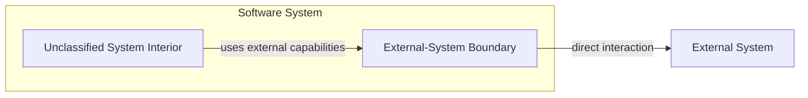
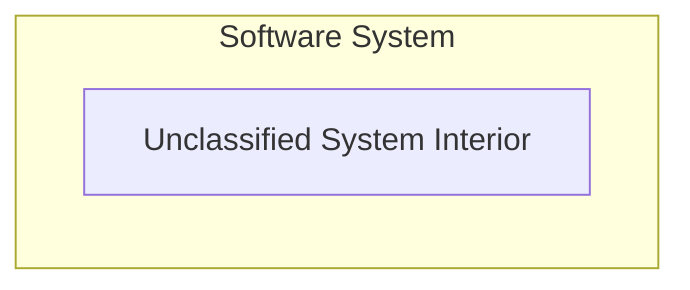
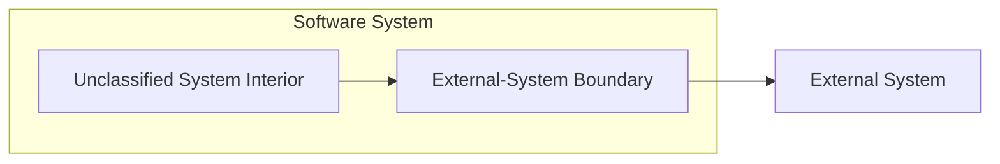

# Architecture Atlas

Architecture Atlas 是一套會隨實際經驗逐步細化的 **logical architecture model** 與 **architecture linting Skills**

它不先假定一套完整的 textbook architecture，也不規定資料夾結構, package layout, monorepo topology, file splitting 或 deployment arrangement。它關心的是 codebase 中有哪些具有獨立責任的 architectural entities, 它們扮演什麼 roles, 彼此存在什麼 relationships, 以及這些責任是否被放在正確的位置

核心想法是:

> A Software System starts as an undifferentiated architectural subject. Experience progressively identifies Architectural Roles and Relationships within it.

尚未被可靠辨識的部分維持 `Unclassified System Interior`; 不因模型尚未完整就強迫它們進入預設 layer 或 role

## Current panorama

目前 Atlas 只辨識出第一個 reusable architectural role: `External-System Boundary`

`Unclassified System Interior` 不是一種 architecture layer，也不是 design defect。它只表示目前 Atlas 尚未對這部分形成足夠穩定且 reusable 的 semantic distinction

未來新的 roles 應從實際 codebase 與重複出現的 responsibility problems 中被辨識，而不是為了填滿全景圖預先建立

## What the Atlas lints

Architecture Atlas 主要檢視三個層次:

1. **Role identification**: 一段 code 或一組 semantic responsibilities 在整體 Software System 中扮演什麼 role
2. **Role-local constraints**: 一個已辨識 entity 是否符合該 role 應有的 responsibility boundary
3. **Relationship constraints**: entities 之間的 dependency, information flow, coordination 與 semantic ownership 是否合理

例如在 `seamless-cors` 中，可以先辨識 `pacsettings` 為 `External-System Boundary`; 接著才從該 role 的角度 lint:

- 是否 expose 超過 current application 需要的 external capabilities 或 outcomes
- 是否將 application-owned coordination 包裝成 external capability
- 是否對 external system 宣稱它沒有提供的 guarantee
- 是否讓 transport, CLI, SDK 或 platform mechanics 漏入 caller

Architecture finding 應優先描述 **semantic responsibility 問題**。是否因此拆 package, 移檔, 建立 module 或改變 repository layout 是後續 implementation decision，不由 Atlas 本身規定

## Skills

### `codebase-architecture`

從整體 Software System 的角度辨識 architectural entities, known roles 與 relationships，建立或更新當下可被支持的 architecture panorama，並對已辨識 roles 套用相應 lint rules

未被可靠分類的 material responsibilities 保持 `Unclassified System Interior`

### `external-system-boundary`

建立或檢視 application 對單一 external system 的最低 direct semantic boundary，例如 third-party HTTP API client, operating-system facility wrapper, CLI client 或 SDK integration seam

它要求 boundary expose **current-needed external capabilities**, contain external mechanics, 保持 external-semantic fidelity，並將 application intent, classification, workflow, coordination 與 access policy 留在 caller

其中一項重要原則是:

> Fact-preserving does not mean fact-exhaustive.

Boundary 只應公開 current callers 做正確決策所需的 distinctions; 不因 external system 或 underlying implementation 存在更多 stages, outcomes 或 metadata 就全部提升成 public API

## Model evolution

Atlas 刻意允許不完整

### Stage 0

### Stage 1

### Future stages

當實際案例反覆顯示新的 responsibility distinction 具有 reusable architecture value 時，再新增新的 `Architectural Role` 以及對應 lint rules，並更新 canonical panorama

不因某個熱門 architecture pattern 存在就自動加入 `domain`, `application`, `infrastructure`, `repository`, `service` 或其他 layers

## Canonical model

共同架構語言, current panorama 與 modeling principles 定義於 [`ARCHITECTURE-MODEL.md`](./ARCHITECTURE-MODEL.md)

Skills 應依該模型解讀 entities, roles 與 relationships，並將各 role 特有的 lint rules 留在對應 Skill 中
